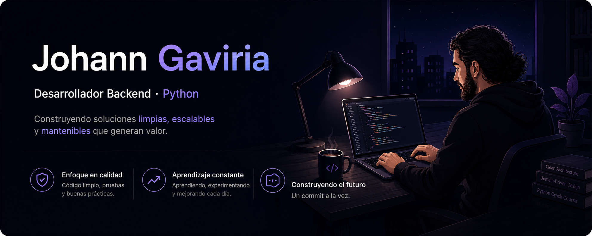

  

Soy desarrollador de software con enfoque en **backend** y alrededor de tres años de experiencia en desarrollo. Me apasiona crear soluciones a través del código, desde convertir una idea en algo funcional hasta enfrentar esos problemas que parecen no tener solución y finalmente encontrarles la vuelta.

A lo largo de este camino he participado en diferentes proyectos colaborativos, fortaleciendo tanto mis habilidades técnicas como mi capacidad para trabajar en equipo. Aunque comencé explorando también el frontend, encontré mi lugar en el backend, donde disfruto especialmente trabajar con la lógica, la arquitectura y la construcción de sistemas.

Soy una persona curiosa y comprometida, siempre buscando aprender, mejorar y asumir nuevos retos. Mi objetivo es seguir creciendo como desarrollador, profundizar mis conocimientos y, a largo plazo, poder liderar equipos sin dejar de hacer lo que más me apasiona: **programar**.

## 💻 Tecnologías

## 📚 Conocimientos Adicionales

## 🚀 Proyectos Destacados

### [Verbose Potato](https://github.com/JohannGaviria/verbose-potato)

API REST para la gestión de una biblioteca, desarrollada con **FastAPI**, enfocada en la aplicación práctica de **Arquitectura Hexagonal (Ports & Adapters)** y un **Monolito Modular orientado al dominio**.

Permite gestionar usuarios, libros y préstamos, aplicando reglas de negocio para garantizar la disponibilidad de ejemplares y la consistencia de los datos.

**Aspectos destacados**

* Arquitectura Hexagonal y Monolito Modular orientado al dominio.
* Autenticación JWT, autorización basada en roles y contraseñas protegidas con Argon2.
* Persistencia y caching con PostgreSQL y Redis.
* Testing unitario, integración y E2E con pipeline CI/CD.

**Tecnologías Utilizadas**

### [Shiny Umbrella](https://github.com/JohannGaviria/shiny-umbrella)

Desarrollo de una API REST que permite a los usuarios crear y participar en encuestas. Ofrece gestión de perfiles, visualización de resultados y notificaciones sobre la actividad de las encuestas, facilitando la recopilación de datos para la toma de decisiones.

**Tecnologías Utilizadas**

### [Miniature Adventure](https://github.com/JohannGaviria/miniature-adventure)

Desarrollo de una API REST para la gestión de ofertas de trabajo entre estudiantes y empresas, permite a los usuarios, ya sean estudiantes o empresas, registrarse y utilizar la plataforma. Las empresas tienen la capacidad de crear, gestionar y eliminar ofertas de trabajo. Por otro lado, los estudiantes pueden visualizar ofertas disponibles y postularse a las ofertas de su preferencia.

**Tecnologias Utilizadas**

